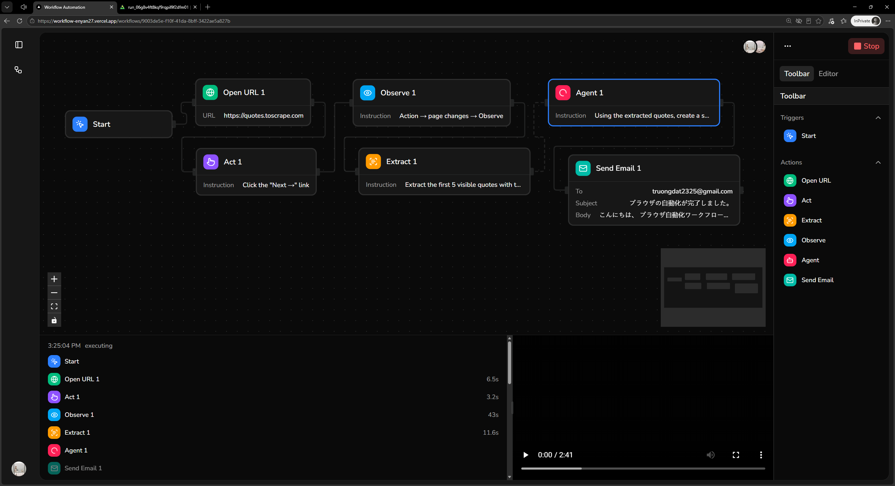
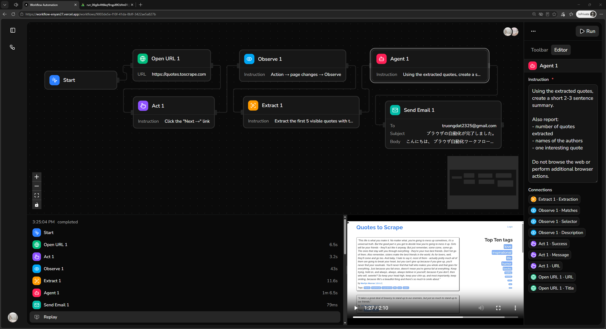

# Browser Automation

- A browser automation platform for automating web navigation, interaction, data extraction and workflows.

## Tech Stack

- Next.js, PostgreSQL, Drizzle, Trigger.dev, Shadcn/ui, Tailwind CSS.

## Features

- User authentication
- Collaborative visual workflow canvas
- AI-powered browser automation for navigation, interaction, observation, extraction and email actions
- Organization workspaces and team management
- Durable background job execution and observability

## Screenshots

Here are some screenshots showcasing the application.




## Prerequisites

- [Node.js](https://nodejs.org)
- [pnpm](https://pnpm.io)

## Installation

```bash
# Clone the repository
git clone https://github.com/enyan27/browser-automation.git

# Navigate to the project directory
cd browser-automation

# Install PHP dependencies
pnpm install

# Create the environment file
cp .env.example .env

# Start the development server
pnpm dev
```
